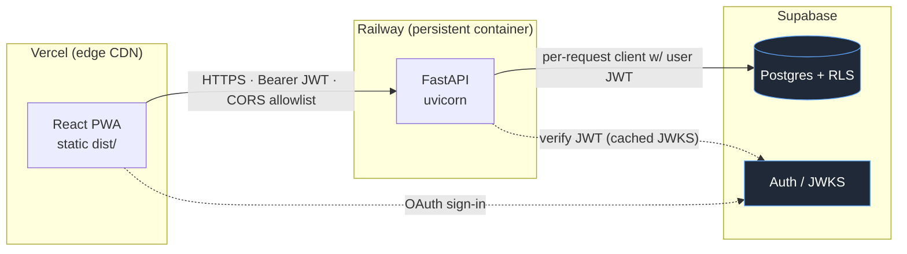
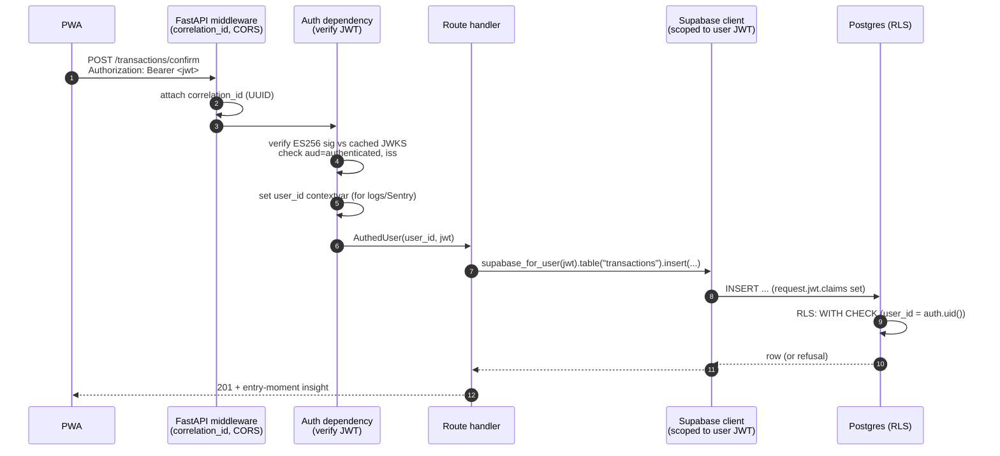

# 01 — Architecture

[← Back to index](./README.md) · Next: [AI Architecture →](./02-ai-architecture.md)

This doc covers the request boundary, the deployment topology, how multi-tenancy is enforced, and the
stack choices (with the rejected alternatives). The AI-specific internals live in
[02 — AI Architecture](./02-ai-architecture.md); the storage layer in [03 — Data & Security](./03-data-and-security.md).

---

## 1. Shape of the system

Tameru is a **two-origin** application by design:

- **Frontend** — a static Vite-built PWA served from Vercel's edge CDN.
- **Backend** — a persistent FastAPI process on Railway.

They talk cross-origin over HTTPS with **Bearer-token auth in the `Authorization` header — never
cookies**. That single choice (token, not cookie) removes an entire category of complexity:
`allow_credentials=False`, no SameSite reasoning, no third-party-cookie breakage, and no CSRF surface.
It's also the property that makes the backend **client-agnostic** — a future native iOS client would
speak the exact same API with no server-side branching.

### Why this hosting split?

| | **Backend → Railway** | **Frontend → Vercel** |
|---|---|---|
| **Pro** | Persistent process: SSE token streaming, 4–6 s agent loops, and `pg_cron` all need a process that doesn't cold-start or time out | Edge CDN → materially better first-paint for a globally-distributed user base; per-PR preview URLs; free tier covers v1 *and* the 100-user forward plan |
| **Pro** | One Dockerfile, GitHub-native CI/CD, ~$10/mo | A PWA shell is a natural CDN workload — after first load the Service Worker serves it locally anyway |
| **Con** | Not serverless → you pay for an always-on container (trivial at this scale) | Two origins to coordinate (CORS) instead of one |
| **Rejected** | *FastAPI on Vercel serverless* — breaks SSE (no persistent process), unreliable token streaming (cold starts), aggressive timeouts kill 4–6 s agent loops | *Co-locating the SPA on Railway* — loses the edge CDN and preview URLs, saves effectively nothing |

**Reversibility was a design goal.** The frontend is just a `dist/` directory — moving it to Cloudflare
Pages or Netlify is under an hour and changes nothing on the backend. That keeps the hosting decision
cheap to revisit, which is the whole point of treating it as a decision rather than a commitment.

---

## 2. The request lifecycle

A typical authenticated request — say, confirming a transaction the agent proposed — flows like this:

Two details that are easy to get wrong and were caught the hard way:

- **The auth dependency is `async`, not `sync`.** A ContextVar set inside a *sync* FastAPI dependency
  doesn't propagate to a *sync* route handler — FastAPI dispatches each via a fresh threadpool context,
  so the `user_id` for structured logging silently came out `null` in production. Making the dependency
  `async` puts the `set` on the main task's context, which every downstream dispatch copies from. (JWT
  verification is microseconds once the JWKS is cached, so running it inline on the event loop is fine.)
- **Unhandled 500s must re-attach the CORS header by hand.** Starlette's `ServerErrorMiddleware` sits
  *outside* `CORSMiddleware`, so an unhandled exception ships a 500 with no `Access-Control-Allow-Origin`
  — the browser blocks it and the PWA shows a contentless "Load failed" with no diagnostic. A catch-all
  exception handler re-attaches the header for allowlisted origins so the UI can render a real error code.

### Fail-fast configuration

The process refuses to boot if a required env var is missing — it lists *every* missing var at once
rather than 500-ing on the first request that needs it. The required set is **tiered**: unconditional
vars (Supabase, Anthropic, Gemini, token secrets) fail in every environment; a second tier
(`SENTRY_DSN`, `FRONTEND_ORIGIN`) only fails when `APP_ENV=production`, because those have working dev
fallbacks. The tier test is simply "*does its absence break local dev?*" — if yes, unconditional.

---

## 3. Multi-tenancy — isolation is a database property

Tameru is multi-tenant from the first migration. The isolation guarantee does **not** live in
application code — it lives in Postgres:

- Every user-owned table carries `user_id UUID NOT NULL REFERENCES auth.users(id) ON DELETE CASCADE`.
- Every such table has `ENABLE ROW LEVEL SECURITY` **and** `FORCE ROW LEVEL SECURITY` (FORCE closes the
  table-owner bypass) with a single policy: `USING (user_id = auth.uid()) WITH CHECK (user_id = auth.uid())`.
- Every query from a user-triggered code path goes through a Supabase client constructed with **that
  user's JWT**, so PostgREST sets `request.jwt.claims` and Postgres resolves `auth.uid()` to the caller.

The consequence: **a bug in a route handler cannot leak one tenant's data to another, because the
database refuses the row.** Authorization is not something the API can forget to check — it's not the
API's job. This is the single most important architectural decision in the system; it gets its own
[trade-off write-up](./04-tradeoffs.md#1-rls-via-the-users-jwt-not-the-service-role) and is the reason
the agent loop is structured the way it is.

A structural test (`tests/contracts/test_no_service_role_leak.py`) fails the build if the elevated
service-role key appears anywhere in a request-handling code path. The only sanctioned service-role
callers are the ones with *no user JWT in scope* (cron jobs, migrations, the Resend webhook) — see
[Data & Security](./03-data-and-security.md#when-the-elevated-key-is-allowed).

---

## 4. The stack, and why

| Layer | Technology | Why this, over what |
|---|---|---|
| **UI framework** | React + Vite | Fast scaffold, huge ecosystem, first-class PWA tooling |
| **Styling** | Tailwind CSS | Mobile-first utility classes, minimal shipped CSS |
| **State** | Zustand | Global state without Redux boilerplate; small enough to read in one sitting |
| **Offline** | Service Worker + IndexedDB | Cache the app shell; queue confirm-taps offline and drain on reconnect |
| **Backend** | FastAPI (Python) | The Anthropic + Gemini SDKs are Python-first; async fits SSE + concurrent agent loops |
| **DB / Auth** | Supabase (Postgres) | RLS at the DB layer, hosted auth (Google OAuth + magic link), backups, dashboard. *Over SQLite:* multi-user write concurrency + DB-layer RLS + auth come free; later migration cost would be high |
| **Agent runtime** | `anthropic` SDK, Messages API + `tool_use`, loop in-process | Keeps the user's JWT in request scope for RLS; full control of middleware (logging, cost gate, backoff). *Over LangChain/LangGraph/ADK/Managed Agents:* see [trade-off #3](./04-tradeoffs.md#3-custom-agent-loop-over-langchainlanggraphadkmanaged-agents) |
| **MCP** | `mcp` SDK, Streamable HTTP | Exposes read-only spending tools to Claude clients; OAuth 2.1 Resource Server |
| **Streaming** | FastAPI SSE + `EventSource` | Token-by-token chat responses |
| **Scheduling** | `pg_cron` + a separate Railway cron service | DB-resident jobs survive deploys; the email digest needs Python + Resend so it's a second Railway service |
| **Email** | Resend | Weekly digest; bounce/complaint webhook for suppression |
| **Analytics** | PostHog | *Structural events only* — never amounts, merchants, or chat text |
| **Errors** | Sentry | Unhandled exceptions, tagged with `correlation_id` + `user_id`; AI-provider failures are deliberately routed to the audit log instead |

### Observability is three surfaces, each with one job

A deliberate separation that's easy to muddle:

1. **`ai_call_log`** — the cost/audit/regression record for *every* AI provider call, written under the
   user's JWT.
2. **Application logs** — JSON to stdout, every line carrying a `correlation_id` and `user_id`, with a
   PII-redaction filter that rewrites forbidden values *before* the line is emitted.
3. **Sentry** — unhandled exceptions only. AI-provider failures are *not* sent here (the audit log
   already records them); 4xx `HTTPException`s are dropped.

The rule "AI failures → audit log, code failures → Sentry, costs → audit log" keeps each surface
answerable for one question. Details in [Data & Security](./03-data-and-security.md#observability).

---

## 5. Offline behavior — scoped on purpose

The PWA is installable and its shell loads offline. But composing a *new* transaction requires
connectivity, because the parse step runs server-side in the agent loop. What the offline queue catches
is the narrow window between "parse card rendered (online)" and "user taps confirm (offline)": the
confirm POST queues in IndexedDB and drains on reconnect.

This is a *scoped* offline story, and the scoping is the interesting part:

- Transaction replays are idempotent via a `client_request_id`; the server returns the existing row.
- Card replays have no such token, but a partial unique index turns a replay into a 409 the drain
  treats as a successful dequeue.
- Queue entries carry `owner_user_id` so a sign-out / sign-in-as-someone-else on the same device can't
  drain entries under the wrong account.
- **No conflict resolution exists — because none can.** [Single active device per user](./04-tradeoffs.md#appendix)
  means there's never a second device to conflict with. The absence of a feature is the design.

---

## 6. CI/CD and the deploy ordering problem

Production releases are sequenced **entirely from GitHub Actions CI**, not from the PaaS Git
integrations. This was a real bug, not a stylistic preference:

> Both Railway and Vercel default to deploying on `git push` via their own webhooks, *racing* the CI
> workflow. Railway's container build finished before CI's `migrate-prod` job applied the Supabase
> migrations — so new backend code could reach prod Postgres *before its migration*, 500-ing any
> handler that depended on a new column until the migration caught up.

The fix: Railway uses its native "Wait for CI" toggle; Vercel's Git integration is disconnected and a
`deploy-frontend` CI job (gated on `needs: [backend-test, frontend-test, migrate-prod]`) owns the
deploy. CI owns release *ordering* — migrations land before the code that needs them. A scheduled
`prod-health.yml` workflow runs the golden-path E2E against live prod daily and opens a deduped GitHub
issue on failure, since push-triggered CI is structurally blind to prod breaking *between* deploys.

---

[← Back to index](./README.md) · Next: [AI Architecture →](./02-ai-architecture.md)
