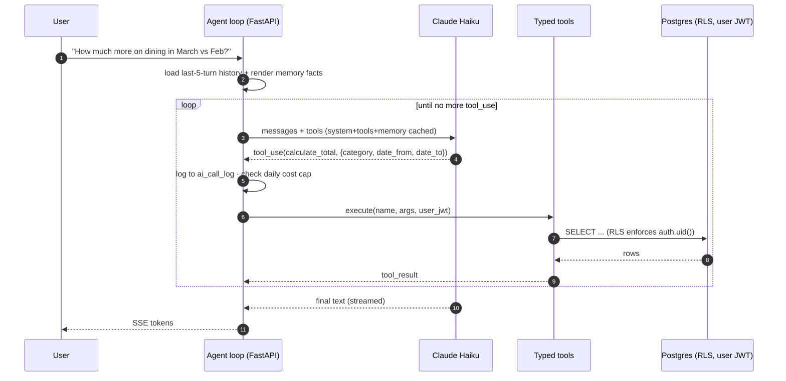
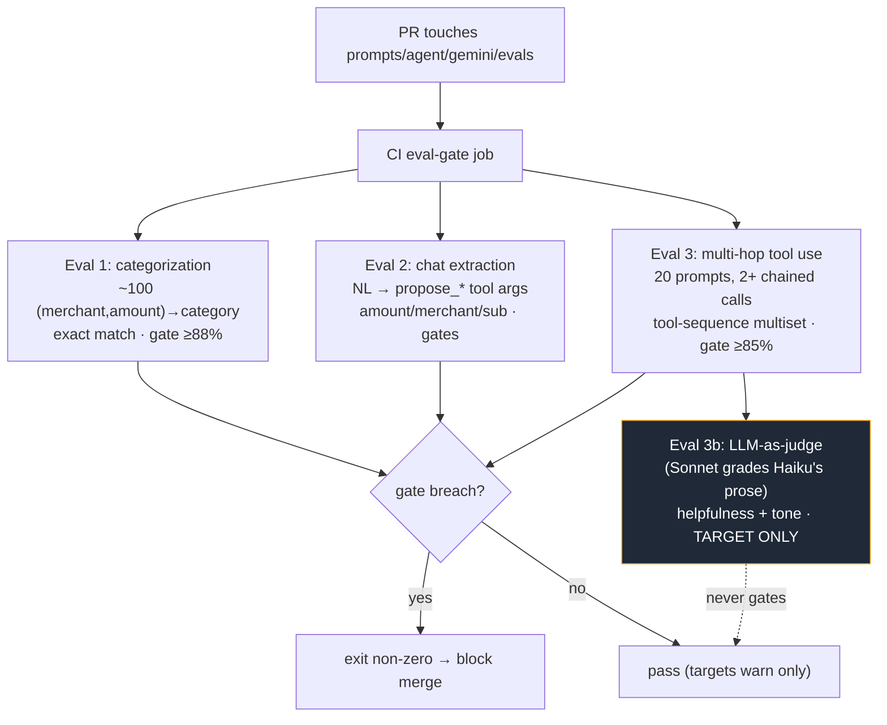

# 02 — AI Architecture

[← Architecture](./01-architecture.md) · [Back to index](./README.md) · Next: [Data & Security →](./03-data-and-security.md)

AI is the *primary interface*, not a feature bolted on. Screens and charts exist for at-a-glance
visibility; the agent handles everything else — entry, categorization, Q&A, and analysis. This doc
covers the agent loop, why it gets typed tools instead of SQL, the MCP server, cross-session memory,
the eval harness, model selection, and the cost model.

---

## The agent loop

The chat agent is the Anthropic **Messages API with `tool_use` blocks**, run as a short loop **inside
the FastAPI request**. No managed agent service, no framework.



**The load-bearing property** is a *lifetime symmetry*: the user's JWT lifetime equals the HTTP
request's lifetime, so `ctx.user_jwt` is a request-local Python variable the typed tools close over
directly. No session container is needed, no credential is at rest, and Supabase RLS auto-enforces
`auth.uid() = user_id` because the JWT is in scope at the moment the tool runs. **Any framework that
inserts a session abstraction between the request and the tool breaks this symmetry** — that's the
deeper reason "JWT in scope" matters more than it sounds, and the reason every agent framework was
rejected. See [trade-off #3](./04-tradeoffs.md#3-custom-agent-loop-over-langchainlanggraphadkmanaged-agents).

**Middleware the loop owns** (the reason for owning the loop in the first place):

- `ai_call_log` — every tool call + result logged before it goes back to Claude.
- Per-user **daily token cap** — chat is the only cost that can run away; a counter gates it at
  ~200K tokens/day (≈10 turns), bounding worst-case spend to ~$6/user/month.
- Per-user 429 backoff — retry once after 2s, then fail gracefully with a user-facing message.
- SSE streaming to React.

---

## Typed tools, not raw SQL

The agent's analytical surface is a registry of ~7 typed Python functions — `get_transactions`,
`calculate_total`, `get_spending_summary`, `get_cards`, `get_subscriptions`, and the `propose_*`
writers — **not** a single `run_sql(sql)` tool. This is the decision I'd most want to defend in an
interview, so it gets a [full write-up in the trade-offs doc](./04-tradeoffs.md#2-typed-tools-over-raw-sql).
The one-line version: *RLS stops cross-user reads; it does not stop the model writing `WHERE date >=
'2025'` when it meant 2026.* In a finance app a wrong-but-plausible number is worse than an error —
errors get reported, wrong numbers get acted on. Typed tools turn that failure class into a bug fixed
once and tested, instead of stochastic per-turn drift.

**Two tool-design details worth calling out:**

- **Card references are short handles, not UUIDs.** `get_cards` returns a `ref` like `amex-1001`
  (`{issuer}-{last_four}`), and the propose tools take `card_ref`. Why: the eval caught Claude dropping
  a hex digit while copying a 36-char UUID between tool calls, silently losing the card attribution.
  LLMs are unreliable at verbatim-copying long random strings — so don't route one through the model.
  A slipped handle **fails closed** (no match → cardless proposal the user corrects) rather than
  mis-resolving to the wrong card.
- **Tool results are size-capped inside the tool**, not trusted from the model side. `get_transactions`
  defaults to 50 / hard-caps at 500; `calculate_total` returns one number. A pathological
  `get_transactions(limit=10000)` can't blow the context window because the cap is enforced server-side.

---

## Propose-then-confirm: the agent never commits

Transactions, cards, and subscriptions are visible on the user's ledger, so writing them on a `tool_use`
call would mean the agent could create a row from a misread message *before the user sees what it
parsed*. Instead:

```
chat → Claude fills propose_transaction(...) args → tool returns a PROPOSAL (no write)
     → UI renders a preview card → user taps "looks right"
     → POST /transactions/confirm writes the row
```

The `tool_use` call is **never** the commit. This is enforced structurally: no write tool exists for
the model to call, and a contract test (`test_tool_write_invariant.py`) fails the build if anyone
widens the `ALLOWED_DIRECT_WRITE_TOOLS` allowlist without a rationale comment. The lone exception is
`set_goal` (goals are low-risk, reversible, and off the transaction ledger). [Full rationale →](./04-tradeoffs.md#4-propose-then-confirm-the-agent-never-commits-a-ledger-row)

---

## The MCP server

Tameru exposes a **read-only** MCP server (Streamable HTTP transport) so a user can query their spending
from Claude.ai, Claude Code, or Claude Desktop. Four tools: `get_spending_summary`,
`get_recent_transactions`, `get_subscriptions`, `get_card_multipliers` — each delegating to the *same*
read functions the chat agent uses, so the two surfaces can't drift.

**Auth is OAuth 2.1**, with Tameru as a *Resource Server* — Supabase Auth's OAuth 2.1 Server is the
Authorization Server. This adds **no new vendor**: Tameru already depends on Supabase. The reason OAuth
(rather than the simpler static bearer tokens a 10-user server could spec-legally use) is concrete:
*Claude.ai's web connector UI accepts only OAuth — no field for a static token or header.* A
Supabase-issued OAuth access token **is a standard Supabase user JWT**, so it verifies through the exact
same JWKS/ES256 path as a browser session and `supabase_for_user(token)` makes Postgres enforce RLS
normally — **the MCP server needs no service role**, keeping the isolation invariant intact.
[Full trade-off →](./04-tradeoffs.md#7-mcp-auth-oauth-21-via-supabase-over-static-bearer-tokens)

**Read-only by construction.** With typed tools there's no SQL parser to gate — the write affordance
simply doesn't exist. A leaked MCP credential can read data; it cannot mutate it.

---

## Cross-session memory

The agent remembers facts across conversations ("your CSR sign-up-bonus target", "you prefer the Amex
for dining") — but **not** with a vector DB.

- **Layer 1, in-session:** the current conversation (capped at the last 5 turns) is replayed each call.
- **Layer 2, cross-session:** after a session goes idle, a background Haiku call distills the
  conversation into *atomic facts*, one row per fact in `user_memory` (not a blob), each with a
  `relevance_score`. One row per fact enables targeted deletion and time-decay pruning.

**Why no vector DB:** at most ~60 structured facts per user. A handful of Postgres rows is faster,
simpler, and more debuggable than a vector store. Add one only if retrieval ever needs semantic search
over long transcripts — which 60 facts don't.

**Two mechanisms worth noting:**

- **Distillation piggybacks the next chat turn** instead of a timer or daemon. Each `POST /chat/turn`
  checks (one SQL predicate) for a prior conversation that's been idle >10 min with ≥4 messages and, if
  found, schedules distillation as a `BackgroundTask` — which captures the *current* turn's fresh JWT.
  This survives Railway worker recycling, iOS `beforeunload` flakiness, and the "user closes the app
  forever" case, all without a new orchestration primitive.
- **The 60-fact cap is *soft*.** A nightly `pg_cron` sweep trims overflow using a pure-SQL
  recency×relevance score; the renderer's `LIMIT 60` hides the brief overflow from the agent. Jobs
  should be *missable-recoverable*, not retry-machined — see the [pg_cron trade-off](./04-tradeoffs.md#6-pg_cron-for-scheduled-jobs-over-a-worker-framework).

---

## The eval harness

AI accuracy is gated in CI, because a model bump or a prompt edit can silently regress extraction.
Three **deterministic** suites plus one **non-gating** LLM-judge dashboard.



**Why deterministic scoring, not LLM-as-judge for the gate?** Tameru's typed-tool architecture makes
every agent action a structured `tool_use(name, args)` call — *exactly assertable*. So the eval asserts
the tool calls (`tool_calls[0] == ("calculate_total", {category:"Dining", ...})`), which survives
prompt rewording, costs zero extra LLM calls, and gates cleanly ("88% is 88%", not "is 3.7/5 a pass?").

**The hybrid.** The *one* irreducibly fuzzy surface — the helpfulness and tone of the final prose
answer — is graded by a stronger model (Sonnet judging Haiku, to avoid the weak-judge / self-preference
trap) as a **non-gating dashboard**. Numerical correctness is deliberately *not* a judge dimension
because the deterministic check already meters whether the right number appears. The split is the
asset: **deterministic owns everything assertable; the judge owns only the unassertable, and never
flips CI.** [Full trade-off →](./04-tradeoffs.md#8-deterministic-evals-that-gate--a-non-gating-llm-judge)

**Targets vs gates** is a first-class concept: the *target* is the accuracy we want (a miss prints a
warning); the *gate* is the floor that blocks a merge (a breach exits non-zero). Keeping them separate
means a target can be aspirational without making CI flaky.

The harness runs the *real* production agent loop against a real seeded Supabase user (not a
service-role bypass — invariant intact), so it exercises the auth + tool + RLS path exactly as a human
chat turn does.

---

## Model selection — the right model per task

| Task | Model | Why |
|---|---|---|
| Chat agent | **Claude Haiku 4.5** | Reliable multi-step typed-tool reasoning |
| Card multiplier lookup | Haiku + `web_search` | Web-grounded, enforced domain allowlist, citations |
| Categorization · CSV · receipt | **Gemini** (env-resolved) | High-frequency, sub-cent, async — speed > peak quality |
| Weekly digest narrative | **Claude Sonnet 4.6** | Prose quality, called only weekly |
| Memory distillation | Haiku | Background fact extraction + scoring |
| Eval answer judge | Sonnet | Stronger than the Haiku student it grades |

**Model strings are read from env vars, never hardcoded** — changing a model is an env change, not a
code change, so a Google deprecation or a preview-model 503 spike is a config rotation.

**Why Haiku for chat, not the cheaper Gemini Flash-Lite?** Flash-Lite would cut the chat bill ~3.4× and
wins general-intelligence benchmarks — but Google's *own* docs steer multi-step agentic reasoning to the
much pricier Gemini Pro, and Tameru's chat *is* multi-step tool reasoning over financial data. For an
app where a wrong number erodes trust, the price delta is cheaper than re-earning trust after a misfired
tool call. The decision isn't permanent: the multi-hop eval suite exists precisely so Flash-Lite can be
A/B'd post-launch on Tameru's *actual* tool surface, not on vendor marketing. [Trade-off →](./04-tradeoffs.md#5-claude-haiku-for-chat-over-gemini-flash-lite)

---

## Cost model

Costs are small and bounded — the interesting part is *which line dominates and why*.

| Line item (10 users) | Monthly | Note |
|---|---|---|
| Claude Haiku — chat | ~$27 | ~65% of the bill |
| Railway (backend) | $10 | Infra floor |
| Everything else (Gemini, web_search, digest, distill, Vercel/Supabase/Sentry/Resend/PostHog free tiers) | ~$0.40 | Rounding error |
| **Total** | **~$37/mo** | **~$3.74/user** |

**Why Claude dominates:** a Gemini categorization is ~205 tokens, single-shot. A Claude agent turn is
~19,000 tokens because the loop replays the full context (system prompt + 60 memory facts + 7 tool
schemas + history + tool_use/result blocks) on every hop, ~3–4 hops per turn — ~90× the tokens, and
~13–17× the per-token rate. One chat turn costs ~1,000× one categorization. **Prompt caching** on the
static prefix (system + tools + memory) takes a 90% discount on cached reads, and the **daily token
cap** is the insurance policy that makes the worst case predictable. Linear projection to 100 users puts
chat at ~$270/mo — the line item that, if the scaling plan ever activates, justifies a freemium gate and
the Flash-Lite A/B.

---

[← Architecture](./01-architecture.md) · [Back to index](./README.md) · Next: [Data & Security →](./03-data-and-security.md)
