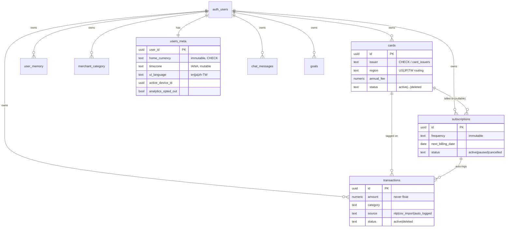
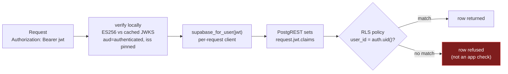

# 03 — Data & Security

[← AI Architecture](./02-ai-architecture.md) · [Back to index](./README.md) · Next: [Design Trade-offs →](./04-tradeoffs.md)

This doc covers the data model, the Row-Level-Security pattern that enforces tenant isolation, the
privacy posture, and the observability surfaces. The headline security decision (RLS via the user's
JWT) is summarized here and argued in full in [trade-off #1](./04-tradeoffs.md#1-rls-via-the-users-jwt-not-the-service-role).

---

## The data model

Schema changes go through Supabase CLI migrations checked into `supabase/migrations/` (51 and counting),
applied by CI on merge — never via the dashboard SQL editor. RLS policies live in the same migration as
the table they protect, so dev and prod can't drift on *who can see what*.

**Three doctrines run through the schema:**

- **Money is `numeric`, never `float`** — and there's a *single, immutable home currency per user*,
  chosen at signup, enforced by a `BEFORE UPDATE` trigger (not application code). v1 has no per-transaction
  FX. See [trade-off #11](./04-tradeoffs.md#11-single-immutable-home-currency--three-decoupled-i18n-axes).
- **Lifecycle is a `status` column + soft delete**, never a hard `DELETE` from an app handler. The three
  ledger tables (cards, transactions, subscriptions) share the idiom; a deleted row stays recoverable
  for support, undo, and "what changed?" forensics. The *defaults are deliberately asymmetric*:
  transactions filter to `status='active'` by default; a closed *card's* historical transactions still
  count toward total spend (the money was really spent); paused subscriptions stay visible in their
  manager but are skipped by the auto-logger.
- **Idempotency keys carry different meanings per table.** The same `client_request_id` column is an
  *idempotency token* on transactions (no natural key — two coffees at the same shop same day is legal),
  a *join key* on cards (the natural key `(user_id, issuer, last_four)` owns dedup), and *both* on
  subscriptions. The framing — "does this table have a natural uniqueness key?" — picks the role.

**Audit tables are different.** `ai_call_log` / `ai_call_log_daily` (AI cost + audit), `chat_turn_trace`
(per-turn agent replay), and `email_log` (send/bounce) are observability, not user content — they're
`SELECT`-only under RLS (no UPDATE/DELETE policy, so a compromised JWT can't scrub history) and excluded
from the user data export.

---

## Row-Level Security: the load-bearing pattern

The FastAPI backend verifies every incoming JWT **locally** against the project's asymmetric JWKS — zero
network round-trips on the hot path once the keys are cached, refreshed only on a `kid` miss.
`algorithms` is pinned to `["ES256"]` (accepting `RS256` too would widen the algorithm-confusion attack
surface for no benefit); `audience` must be `authenticated` and `issuer` must match the project, so a
token minted by a *different* Supabase project can't authenticate. The legacy shared HS256 secret is
deliberately absent.

Then: the backend builds a Supabase client **with that JWT** per request, Postgres resolves
`auth.uid()` to the caller, and the RLS policy `USING (user_id = auth.uid())` does the rest. **The API
cannot forget to authorize, because authorizing isn't the API's job.**

### When the elevated key *is* allowed

The service-role key bypasses RLS, so it's confined to callers with **no user JWT in scope** — and only
these four, enumerated by name rather than relaxed to "system code":

1. The `pg_cron` subscription auto-logger (a DB function — no app context).
2. Supabase CLI migrations (run from CI).
3. The weekly digest cron (`app/cron/digest.py`) — a Monday-morning batch has no single recipient's JWT.
4. The Resend bounce/complaint webhook — the request is from Resend, not a logged-in user.

A structural test fails the build if the service-role key appears in a request-handling path; the cron
directories are excluded by directory, the webhook by a per-file allowlist with a rationale comment. The
discipline (enumerate, don't relax) is what's kept the security boundary from eroding across ~40
decisions.

### Cross-table writes — Supabase has no multi-statement transaction primitive

`supabase-py` issues each `insert/update/delete` as an independent PostgREST round-trip — there's no
`with client.atomic():`. So the write mechanism is chosen by *shape*:

| Shape | Mechanism | Example |
|---|---|---|
| User-intent cross-table write | `SECURITY DEFINER` plpgsql function via `client.rpc()` (one implicit transaction) | "delete card → pause its subscriptions, cancel its annual-fee sub" |
| Derived-value denormalization | DB trigger on the source column | rename a card → its annual-fee sub's name follows |
| Single-table write, no side effects | direct PostgREST `.update()` | edit a transaction amount |

Faking atomicity in Python with `try/except` was the original bug (a card could be created with its
companion annual-fee sub orphaned, and the route still returned 200). [Trade-off →](./04-tradeoffs.md#10-cross-table-writes-by-shape-rpc-vs-trigger-vs-direct)

---

## Privacy posture

Privacy is a product feature here, and the code is structured so a careless future change *fails the
build* rather than quietly leaking.

- **Financial data lives in the user's Supabase project under RLS.** The only third-party egress is the
  AI calls required for categorization, chat, and card lookup.
- **Anthropic:** Zero Data Retention requested for the org; not used for training under any tier. The
  card-lookup `web_search` path sends only the public card name + last 4 — never transaction data.
- **Gemini:** paid tier only (the free tier trains on data and is forbidden).
- **PostHog: structural events only.** Six whitelisted events (`chat_session_started`,
  `feature_used`, …); a TypeScript discriminated union makes any off-list event a *compile error*. Every
  auto-instrument feature (autocapture, session replay, heatmaps, web vitals) is disabled at *both* the
  SDK and the project level — each is a concrete content-leak vector in a finance app (autocapture reads
  button text like "$47.23 at Trader Joe's"; replay records the screen). The SDK also boots
  **opted-out-by-default** and only opts in *after* `/me` confirms the user's preference, so nothing
  leaks in the cold-load race before the preference resolves.
- **Application logs** run through a `PiiRedactionFilter` that rewrites amounts, merchant text, emails,
  JWTs, and the service-role key to `<redacted:reason>` *before* the line is emitted; Sentry runs the
  same filter in `before_send`.

The rule, stated as a tripwire: *if you find yourself adding any field to a PostHog event, log line, or
Sentry `extra` that contains user-generated text or financial numbers — stop.*

**Data export** is a single RLS-scoped `GET /export` that dumps the user's seven content tables as JSON,
downloaded client-side via a Blob — no Supabase Storage, no signed URL, no token (the JWT is already the
auth). Internal observability tables are deliberately excluded.

---

## Observability

Three surfaces, each answerable for exactly one question (repeated from
[Architecture](./01-architecture.md#observability-is-three-surfaces-each-with-one-job) because it's a
security property too):

| Surface | Question it answers | Written under |
|---|---|---|
| `ai_call_log` (Postgres) | "What did the AI cost / do, and did it regress?" | the user's JWT (RLS) |
| Structured stdout logs | "What happened in this request?" (`correlation_id` + `user_id`) | redaction filter |
| Sentry | "What *crashed* (unhandled exceptions)?" | redaction filter, 4xx dropped |

AI-provider failures go to `ai_call_log`, **not** Sentry (the audit log already records them) — so the
audit-pipeline canary stays visible and Sentry stays signal. No separate logging vendor at this scale:
Railway stdout + Sentry is the supported stack.

---

[← AI Architecture](./02-ai-architecture.md) · [Back to index](./README.md) · Next: [Design Trade-offs →](./04-tradeoffs.md)
