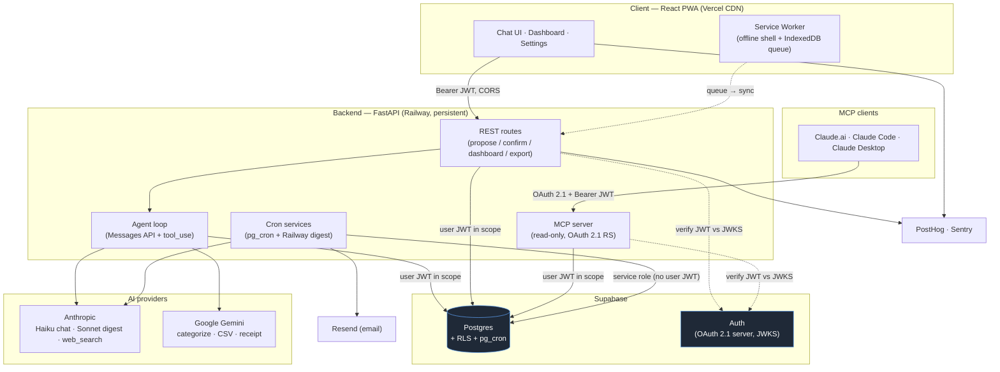

# Tameru — System Design

> A mobile-first PWA for **spending intelligence**: manual transaction entry, AI-assisted
> categorization, an agentic chat that reasons over your spending data, and an MCP server that
> exposes that data to any MCP client. Multi-tenant from day one.

This folder is the engineering-facing design doc. It's written to show the *decisions* and the
*trade-offs* behind them — not just what was built, but why each choice was made over a tempting
alternative, and what was given up. If you only read one section, read [Design Trade-offs](./04-tradeoffs.md).

---

## Table of contents

| Doc | What's in it |
|---|---|
| **README** (this file) | Executive summary, system overview, the architecture in one diagram |
| [01 — Architecture](./01-architecture.md) | Request lifecycle, hosting topology, multi-tenant isolation, the stack and why |
| [02 — AI Architecture](./02-ai-architecture.md) | The agent loop, typed tools, MCP server, cross-session memory, the eval harness, cost model |
| [03 — Data & Security](./03-data-and-security.md) | Data model, the RLS pattern, privacy posture, observability |
| [04 — Design Trade-offs](./04-tradeoffs.md) | The 12 decisions I'd defend in an interview, each with pros/cons + an appendix index of ~25 more |
| [diagrams/](./diagrams/) | Excalidraw "hero" diagrams (system overview, request lifecycle, agent loop) |

---

## Executive summary

**The thesis.** Most people don't overspend because they lack a budget — they overspend because they
lack *awareness*. Auto-sync apps (Mint, Rocket Money) remove the one habit that builds awareness: the
act of noticing a purchase. Tameru makes manual entry a feature, not an apology, and layers AI on top
to remove the tedium (categorization, pattern-finding, Q&A) without removing the awareness.

**What makes it interesting as an engineering artifact:**

- **A custom agent loop, not a framework.** The Claude chat agent runs as an ~80-line `tool_use` loop
  *inside* the FastAPI request, deliberately rejecting LangChain / LangGraph / Managed Agents / Google
  ADK. The reason is a single load-bearing property — *the user's JWT lifetime equals the HTTP request's
  lifetime* — which lets Postgres Row-Level Security enforce tenant isolation with zero application-level
  authorization code. ([why](./02-ai-architecture.md#the-agent-loop), [trade-off](./04-tradeoffs.md#3-custom-agent-loop-over-langchainlanggraphadkmanaged-agents))
- **Security is enforced by the database, not the API.** Every request carries the user's JWT; every
  Supabase query runs under it; Postgres refuses the row if `auth.uid() != user_id`. A bug in a route
  handler *cannot* leak one tenant's data to another. ([how](./03-data-and-security.md#row-level-security-the-load-bearing-pattern))
- **The agent gets typed tools, never raw SQL** — because in a finance app a *wrong-but-plausible*
  number is worse than an error, and RLS doesn't protect against the model writing `WHERE date >= '2025'`
  when it meant 2026. ([why](./04-tradeoffs.md#2-typed-tools-over-raw-sql))
- **No AI write is ever a commit.** The agent can *propose* a transaction; only an explicit user tap on a
  preview card writes the row. Enforced structurally by a build-failing test, not by convention. ([why](./04-tradeoffs.md#4-propose-then-confirm-the-agent-never-commits-a-ledger-row))
- **Evals gate CI.** Three deterministic suites (categorization, chat extraction, multi-hop tool use)
  plus a *non-gating* LLM-as-judge dashboard for the one irreducibly fuzzy surface (answer tone). ([how](./02-ai-architecture.md#the-eval-harness))

**Scope (deliberately small).** v1 is invite-only, ~10 friends and family, free, no Stripe, no Plaid.
The cost ceiling is ~$37/month total (~$3.74/user). A conditional plan to scale to ~100 users with a
paid tier exists but is explicitly *not* built. Small scope is a feature: it lets every decision be made
on engineering merit rather than growth pressure.

**By the numbers** (as of this writing): ~16K lines of Python across the backend, 51 checked-in SQL
migrations, 68 test files (including 8 *structural* contract tests that fail the build on invariant
violations), and ~164 TypeScript/React files on the frontend.

---

## The system in one diagram

**Reading the diagram — the one thing that matters:** every arrow into Postgres that originates from a
*user action* (`ROUTES`, `LOOP`, `MCPSRV`) carries **the user's own JWT**, so the database enforces
tenant isolation. The *only* arrows that use the elevated service role are the cron jobs — and they use
it precisely because they have *no user JWT in scope* (a Monday-morning batch over all users has no
single recipient's session). That asymmetry is the spine of the security model; see
[trade-off #1](./04-tradeoffs.md#1-rls-via-the-users-jwt-not-the-service-role).

---

## Tech stack at a glance

| Layer | Choice | One-line rationale |
|---|---|---|
| Frontend | React + Vite + Tailwind + Zustand (PWA) | Fast scaffold, small bundle, installable, offline shell |
| Backend | FastAPI (Python, async) | Native fit for the Anthropic/Gemini SDKs; persistent process for SSE + agent loops |
| Database | Supabase (Postgres + Auth + RLS) | Tenant isolation *at the DB layer*; auth + dashboard + backups included |
| Chat agent | Claude Haiku 4.5 (Messages API + `tool_use`) | Reliable multi-step tool reasoning; cheap enough at this scale |
| Bulk parsing | Google Gemini (env-resolved) | Categorization / CSV / receipt — sub-cent, high-frequency, async |
| Card lookup | Claude Haiku + `web_search` server tool | Web-grounded multipliers with an enforced domain allowlist + citations |
| MCP | `mcp` Python SDK (Streamable HTTP) | Read-only spending tools, OAuth 2.1 Resource Server |
| Scheduling | Postgres `pg_cron` + a Railway cron service | Auto-logger & memory sweep survive API deploys; digest needs Python/Resend |
| Hosting | Railway (backend) + Vercel (frontend CDN) | Persistent process where needed, edge CDN where it helps |
| Email / Analytics / Errors | Resend / PostHog / Sentry | Weekly digest; structural events only; unhandled exceptions |

Full stack rationale (including the rejected options) is in [01 — Architecture](./01-architecture.md#4-the-stack-and-why).

---

## How to read the rest

The sub-docs go from the outside in: [Architecture](./01-architecture.md) (the request boundary and
deployment shape) → [AI Architecture](./02-ai-architecture.md) (what happens inside the agent loop) →
[Data & Security](./03-data-and-security.md) (the storage and isolation layer underneath). The
[Trade-offs](./04-tradeoffs.md) doc is the cross-cutting one — it's where the actual engineering
judgment lives, and it stands alone if you're short on time.

*This design doc is distilled from the project's full internal `DESIGN.md` (~1,800 lines) and a
decision log of ~40 dated entries. Where a decision references "memory" or a "Day N" milestone, that's
the source.*
